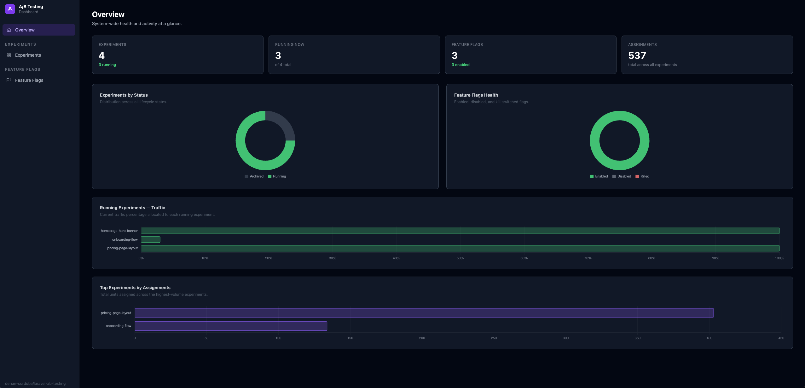

# Laravel A/B Testing

Standalone experimentation primitives for Laravel: typed experiments, deterministic bucketing, reusable metrics, Bayesian and frequentist analysis, and a package architecture that can grow into a full experimentation platform.

This package is intentionally not a thin feature-flag helper. It is designed around real experimentation concerns: stable assignment units, explicit control and traffic allocation, reusable metrics, sample-ratio mismatch detection, and normalized experiment definitions that can be consumed by both code-defined and runtime-defined workflows.



## Contents

- [Current status](#current-status)
- [Why this package](#why-this-package)
- [Installation](#installation)
- [Quick start](#quick-start)
- [Defining units](#defining-units)
- [Defining metrics](#defining-metrics)
- [Defining variants](#defining-variants)
- [Defining experiments](#defining-experiments)
- [Registering experiments](#registering-experiments)
- [Resolving variants](#resolving-variants)
- [Tracking metrics](#tracking-metrics)
- [Real-world request flow](#real-world-request-flow)
- [Dashboard](#dashboard)
- [Discovery and caching](#discovery-and-caching)
- [Running statistical analysis](#running-statistical-analysis)
- [Feature flags](#feature-flags)
- [Architecture](#architecture)
- [Production integration](#production-integration)
  - [Storage driver](#storage-driver)
- [Testing](#testing)
- [Current limitations](#current-limitations)
- [Contributing](#contributing)
- [License](#license)

## Current status

This repository already includes the foundational engine and several important runtime pieces:

- Attribute-based experiment definitions via `#[AsExperiment]`, `#[AsMetric]`, `#[AsUnit]`, and related attributes
- Typed variant enums with explicit control and weight declarations
- Deterministic bucketing with an SHA-256 strategy
- Assignment persistence behind repository contracts
- A resolution pipeline for eligibility, traffic checks, sticky assignment, and layer exclusion
- Database-backed event recording for exposures and metrics
- Incremental rollups over raw events for dashboard reads
- Bayesian and frequentist analysis engines
- Sample-ratio mismatch detection
- A built-in Livewire dashboard with experiment overview, detail pages, controls, audit trail, and results tables
- Experiment registration from configuration and optional discovery

Some larger platform pieces are still intentionally not presented as finished:

- Runtime-defined experiment authoring in the dashboard
- Full feature-flag registry and runtime integration

The README below focuses on what exists today and shows how to use the package honestly in its current form.

## Why this package

Most Laravel A/B testing packages stop at "split users into two buckets and count conversions". This package is aiming at a stricter model:

- Experiments are typed PHP classes, not magic strings
- Variants are backed enums, not loose arrays
- Assignment is deterministic and sticky
- Assignment and exposure are different events
- Metrics are reusable definitions with explicit roles
- Analysis is unit-based, not raw-event-based
- Frequentist and Bayesian results can live side by side
- The engine consumes a normalized `ExperimentDefinition`, so code-defined and runtime-defined experiments can converge on the same core

## Installation

Install the package with Composer:

```bash
composer require derian-cordoba/laravel-ab-testing
```

Publish the configuration file:

```bash
php artisan vendor:publish --tag=ab-testing-config
```

Run the migrations:

```bash
php artisan migrate
```

If you want to customize the package dashboard views, publish them:

```bash
php artisan vendor:publish --tag=ab-testing-dashboard-views
```

The package supports Laravel package discovery, so you should not need to register the service provider manually.

### Requirements

- PHP `^8.4`
- Laravel components `illuminate/support ^13.0`
- `illuminate/console ^13.0`

## Quick start

The package revolves around four structural definitions:

1. A unit type that can be bucketed
2. A reusable metric
3. A backed enum of variants
4. An experiment class that ties them together

Here is a complete minimal example.

### 1. Define the assignment unit

```php
<?php

declare(strict_types=1);

namespace App\ABTesting;

use ABTests\Attributes\AsUnit;
use ABTests\Contracts\Bucketable;
use App\Models\User;

#[AsUnit(key: 'user')]
final readonly class ExperimentUser implements Bucketable
{
    public function __construct(private User $user)
    {
        //
    }

    public function bucketingKey(): string
    {
        return "user:{$this->user->getKey()}";
    }

    public function attributes(): array
    {
        return [
            'plan' => $this->user->plan,
            'country' => $this->user->country,
        ];
    }
}
```

### 2. Define the metric

```php
<?php

declare(strict_types=1);

namespace App\ABTesting\Metrics;

use ABTests\Attributes\AsMetric;
use ABTests\Enums\Aggregate;
use ABTests\Enums\MetricType;
use ABTests\Metric;

#[AsMetric(
    key: 'checkout-conversion',
    type: MetricType::binary,
    event: 'checkout.completed',
    aggregate: Aggregate::uniqueUnits,
)]
final class CheckoutConversion extends Metric
{
    //
}
```

### 3. Define the variants

```php
<?php

declare(strict_types=1);

namespace App\ABTesting\Variants;

use ABTests\Attributes\Control;
use ABTests\Attributes\Weight;
use ABTests\Concerns\IsVariant;
use ABTests\Contracts\Variant;

enum CheckoutButtonVariant: string implements Variant
{
    use IsVariant;

    #[Control]
    #[Weight(50)]
    case control = 'control';

    #[Weight(50)]
    case green = 'green';
}
```

### 4. Define the experiment

```php
<?php

declare(strict_types=1);

namespace App\ABTesting\Experiments;

use ABTests\Attributes\Analysis;
use ABTests\Attributes\AsExperiment;
use ABTests\Attributes\PrimaryMetric;
use ABTests\Enums\StatisticalEngine;
use ABTests\Experiment;
use ABTests\Values\Segment;
use App\ABTesting\ExperimentUser;
use App\ABTesting\Metrics\CheckoutConversion;
use App\ABTesting\Variants\CheckoutButtonVariant;

#[AsExperiment(
    key: 'checkout-button-color',
    unit: ExperimentUser::class,
    variants: CheckoutButtonVariant::class,
    name: 'Checkout button color',
    layer: 'checkout-ui',
)]
#[PrimaryMetric(CheckoutConversion::class)]
#[Analysis(
    engine: StatisticalEngine::both,
    confidenceLevel: 0.95,
    sequential: true,
)]
final class CheckoutButtonColor extends Experiment
{
    public function audience(): Segment
    {
        return Segment::where('plan', 'pro')->and('country', 'US');
    }
}
```

### 5. Register the experiment

Add it to `config/ab-testing.php`:

```php
'experiments' => [
    \App\ABTesting\Experiments\CheckoutButtonColor::class,
],
```

### 6. Resolve the variant

```php
use ABTests\Experiments;
use App\ABTesting\ExperimentUser;
use App\ABTesting\Experiments\CheckoutButtonColor;
use App\ABTesting\Variants\CheckoutButtonVariant;

$user = new ExperimentUser($request->user());

$variant = Experiments::for($user)->variant(CheckoutButtonColor::class);

return match ($variant) {
    CheckoutButtonVariant::green => view('checkout.green'),
    CheckoutButtonVariant::control, null => view('checkout.default'),
};
```

### 7. Track the conversion

```php
use ABTests\Experiments;
use App\ABTesting\Metrics\CheckoutConversion;

Experiments::track(CheckoutConversion::class, for: $user);
```

## Defining units

Every experiment and metric event is anchored to a unit that implements `ABTests\Contracts\Bucketable`.

A unit must provide:

- `bucketingKey()`: the stable identifier used for deterministic assignment
- `attributes()`: a flat attribute array used for audience targeting

Use `#[AsUnit]` to give each unit type a stable storage key:

```php
#[AsUnit(key: 'tenant')]
final class TenantUnit implements Bucketable
{
    // ...
}
```

The `key` argument accepts either:

- a plain string
- a backed enum case
- a unit enum case, which resolves to its case name

That normalization follows the same semantics as Laravel's `enum_value()` helper.

## Defining metrics

Metrics are reusable definitions. An experiment does not describe how a conversion is measured; it references one or more metrics and assigns them roles.

Available metric attributes:

- `#[PrimaryMetric(...)]`
- `#[SecondaryMetric(...)]`
- `#[Guardrail(...)]`

Example:

```php
#[PrimaryMetric(CheckoutConversion::class)]
#[SecondaryMetric(RevenuePerVisitor::class)]
#[Guardrail(ErrorRate::class, maximumRegression: 0.01)]
```

The `#[AsMetric]` attribute describes the metric itself:

```php
#[AsMetric(
    key: 'revenue-per-visitor',
    type: MetricType::continuous,
    event: 'checkout.completed',
    aggregate: Aggregate::sum,
    valueFromProperty: 'revenue',
    attributionWindow: '7 days',
)]
final class RevenuePerVisitor extends Metric
{
    public function valueOf(array $properties): float
    {
        return (float) ($properties['revenue'] ?? 0.0);
    }
}
```

### Metric roles

- Primary metric: drives the ship or do-not-ship decision
- Secondary metric: useful for supporting interpretation
- Guardrail metric: must not regress beyond the allowed threshold

### Raw metric keys are also supported

The runtime tracking layer accepts either:

- a metric class-string, such as `CheckoutConversion::class`
- a raw metric key, such as `'checkout-conversion'`

That matters because the core engine is designed to support both code-defined and runtime-defined experiments.

## Defining variants

Variants must be backed enums that implement `ABTests\Contracts\Variant`. The easiest way to satisfy the contract is to use the `ABTests\Concerns\IsVariant` trait.

Rules enforced by the package:

- each variant must have a `#[Weight(...)]`
- weights must sum to `100`
- exactly one variant must carry `#[Control]`

Example with three arms:

```php
enum PricingPageVariant: string implements Variant
{
    use IsVariant;

    #[Control]
    #[Weight(34)]
    case control = 'control';

    #[Weight(33)]
    case headlineA = 'headline_a';

    #[Weight(33)]
    case headlineB = 'headline_b';
}
```

The package preserves the original enum case on resolution, so downstream application code can use `match` exhaustively and stay type-safe.

## Defining experiments

Use `#[AsExperiment]` on a class extending `ABTests\Experiment`.

```php
#[AsExperiment(
    key: 'pricing-page-headline',
    unit: ExperimentUser::class,
    variants: PricingPageVariant::class,
    name: 'Pricing page headline',
    layer: 'pricing-page',
)]
```

### Experiment structure

The attribute captures the structural parts of an experiment:

- stable experiment key
- assignment unit type
- variant enum
- optional human-readable name
- optional mutual-exclusion layer

These are treated as code-owned structure. In the intended architecture, operational state such as running, paused, and traffic percentage belongs to persistence and dashboard workflows, not the class definition itself.

### Audience targeting

Override `audience()` when the experiment should only apply to a segment:

```php
use ABTests\Experiment;
use ABTests\Values\Segment;

final class PricingPageHeadline extends Experiment
{
    public function audience(): Segment
    {
        return Segment::where('country', 'US')
            ->and('plan', 'pro');
    }
}
```

The current `Segment` API supports conjunctions of criteria and operators such as:

- `equals`
- `notEquals`
- `in`
- `notIn`
- `greaterThan`
- `lessThan`

## Registering experiments

The package boots an `ExperimentRegistry` from configuration.

In `config/ab-testing.php`:

```php
return [
    'experiments' => [
        \App\ABTesting\Experiments\CheckoutButtonColor::class,
        \App\ABTesting\Experiments\PricingPageHeadline::class,
    ],

    'discovery' => [
        'enabled' => false,
        'paths' => [
            // app_path('Experiments'),
        ],
    ],
];
```

If an experiment cannot be read at boot, the service provider logs the failure instead of crashing the whole app.

## Resolving variants

The main entry point is `ABTests\Experiments`.

```php
$variant = Experiments::for($unit)->variant(CheckoutButtonColor::class);
```

Resolution goes through a pipeline with the following responsibilities:

- check whether the experiment is active
- verify segment eligibility
- verify traffic allocation
- load any existing sticky assignment
- enforce layer exclusion
- compute a deterministic bucket when needed
- persist the assignment

When a variant is successfully resolved, the package records an exposure event through the configured `EventSink`.

### Null return values

`variant()` returns `null` when the unit should not receive the experiment at all. Typical reasons include:

- the experiment is not active
- the unit does not match the audience segment
- the unit falls outside the active traffic percentage
- the unit is excluded by a layer conflict

That is intentional. "Not eligible" is not the same thing as "assigned to control".

## Tracking metrics

Track a metric for a unit with either the facade or the per-unit resolver:

```php
Experiments::track(CheckoutConversion::class, for: $unit);

Experiments::for($unit)->track(CheckoutConversion::class);
```

You can also pass a raw metric key:

```php
Experiments::for($unit)->track('checkout-conversion');
```

For continuous metrics:

```php
Experiments::for($unit)->track('revenue-per-visitor', value: 149.99);
```

Tracking behavior:

- the metric key is normalized from the metric class when possible
- the resolver iterates over registered experiment definitions
- only experiments with a current assignment for that unit receive a metric event
- the event is recorded with a unique idempotency key

## Real-world request flow

Below is a realistic end-to-end checkout flow showing where variant resolution and metric tracking usually belong in an application.

### Controller example

```php
<?php

declare(strict_types=1);

namespace App\Http\Controllers;

use ABTests\Experiments;
use App\ABTesting\ExperimentUser;
use App\ABTesting\Experiments\CheckoutButtonColor;
use App\ABTesting\Metrics\CheckoutConversion;
use App\ABTesting\Variants\CheckoutButtonVariant;
use Illuminate\Http\Request;
use Illuminate\View\View;

final class CheckoutController
{
    public function show(Request $request): View
    {
        $user = new ExperimentUser($request->user());

        $variant = Experiments::for($user)->variant(CheckoutButtonColor::class);

        return match ($variant) {
            CheckoutButtonVariant::green => view('checkout.green'),
            CheckoutButtonVariant::control,
            null => view('checkout.default'),
        };
    }

    public function complete(Request $request): \Illuminate\Http\RedirectResponse
    {
        $user = new ExperimentUser($request->user());

        // Your real checkout logic goes here.

        Experiments::track(CheckoutConversion::class, for: $user);

        return redirect()->route('checkout.success');
    }
}
```

### Practical guidance

- Resolve the variant at the point where the user actually experiences the change, not earlier in the request chain for convenience.
- Track the metric at the point where the outcome actually happens, not when you merely intend it to happen.
- Rebuild the same unit shape consistently across requests so sticky assignment remains meaningful.
- Treat `null` as "this user is not in the experiment", not as "fallback control".
- Keep experiment keys, metric keys, and unit keys stable over time. Changing them creates a new experiment from the engine's point of view.

### A good mental model

One safe way to think about the package is:

- `variant()` is for exposure
- `track()` is for outcomes

If those two calls happen in the correct places, the rest of the package architecture stays coherent.

## Dashboard

The package ships with a Livewire dashboard mounted at `/ab-testing` by default. It is intended to be the operational surface for experiment state:

- overview of registered experiments
- per-experiment results and analysis
- start, pause, resume, stop, archive, kill-switch, and traffic ramp controls
- audit log entries for state transitions
- manual rollup refresh when you want new data immediately

### Dashboard access

The dashboard route prefix, middleware stack, and viewer gate are configured in `config/ab-testing.php`:

```php
'dashboard' => [
    'path' => env('AB_TESTING_DASHBOARD_PATH', 'ab-testing'),
    'middleware' => ['web'],
    'viewer_gate' => 'viewAbTestingDashboard',
    'results_cache_ttl_seconds' => (int) env('AB_TESTING_RESULTS_CACHE_TTL', 300),
    'auto_schedule_rollups' => (bool) env('AB_TESTING_AUTO_SCHEDULE_ROLLUPS', true),
],
```

Define the gate in your application if you want to restrict access:

```php
use Illuminate\Support\Facades\Gate;

Gate::define('viewAbTestingDashboard', function ($user): bool {
    return $user->is_admin;
});
```

If the configured gate does not exist, the package middleware falls back to whatever access rules your configured dashboard middleware already enforces.

### What the dashboard reads

The dashboard does not scan raw event tables on every request. It reads pre-aggregated rows from `ab_testing_rollups` through `ResultsService`, then runs the analysis layer on those summaries.

That separation matters:

- raw events remain append-only
- the request path stays fast
- manual refreshes and scheduled rollups produce the dashboard data intentionally

### Making results appear

To see data in the dashboard:

1. Run the package migrations.
2. Register your experiments in `config/ab-testing.php`.
3. Ensure each experiment has an operational state row in `ab_testing_experiments`.
4. Put the experiment into `running` state, either through the dashboard or your own setup code.
5. Generate exposures and metric events by resolving variants and tracking outcomes.
6. Let the scheduled rollup run or use the dashboard's `Refresh Data` control.

### Rollup scheduling

When `ab-testing.dashboard.auto_schedule_rollups` is enabled, the package registers `RefreshRollupsJob` with Laravel's scheduler automatically. You still need a normal scheduler/queue setup in the host app:

```bash
php artisan schedule:work
```

Or your usual production scheduler:

```bash
* * * * * php /path/to/artisan schedule:run >> /dev/null 2>&1
```

For local development, the dashboard can also trigger a manual per-experiment refresh so you do not have to wait for the next scheduled cycle.

## Discovery and caching

The package includes an `ab:cache` Artisan command:

```bash
php artisan ab:cache
```

When discovery is enabled in config, the command scans configured paths for PHP classes, extracts class names without executing the files, reads `#[AsExperiment]` definitions, and registers them in the runtime registry.

Example config:

```php
'discovery' => [
    'enabled' => true,
    'paths' => [
        app_path('Experiments'),
    ],
],
```

This is useful when you want explicit deployment-time registration without manually maintaining a long config list.

## Running statistical analysis

The analysis layer is already present as a framework-agnostic service. It expects pre-aggregated unit-level summaries rather than raw events.

```php
use ABTests\Statistics\AnalysisService;
use ABTests\Values\GenericVariant;
use ABTests\Values\MetricSummary;

$control = new MetricSummary(
    variant: new GenericVariant('control', 50, true),
    countOfUnits: 1000,
    sumOfValues: 120,
    sumOfSquaredValues: 120,
    conversions: 120,
);

$treatment = new MetricSummary(
    variant: new GenericVariant('green', 50),
    countOfUnits: 1000,
    sumOfValues: 145,
    sumOfSquaredValues: 145,
    conversions: 145,
);

$result = app(AnalysisService::class)->analyse(
    definition: $definition,
    control: $control,
    treatment: $treatment,
    allSummaries: [$control, $treatment],
);

$result->verdict;      // ship | doNotShip | inconclusive
$result->frequentist;  // AnalysisResult|null
$result->bayesian;     // AnalysisResult|null
$result->srm;          // SampleRatioMismatchResult
```

### What the analysis layer does

- runs the configured engine: frequentist, Bayesian, or both
- performs sample-ratio mismatch detection across all summaries
- returns a `VerdictResult` with both raw engine outputs and the final verdict

### Statistical defaults

By default, experiments use:

- `StatisticalEngine::both`
- `0.95` confidence
- sequential inference enabled

These defaults come from `AnalysisConfiguration::default()`.

## Feature flags

The package already contains a `FeatureFlag` base class and `#[AsFeatureFlag]` attribute:

```php
use ABTests\Attributes\AsFeatureFlag;
use ABTests\FeatureFlag;
use ABTests\Values\Context;
use App\ABTesting\ExperimentUser;

#[AsFeatureFlag(
    key: 'new-billing-page',
    unit: ExperimentUser::class,
    defaultValue: false,
)]
final class NewBillingPageFlag extends FeatureFlag
{
    public function resolve(Context $context): mixed
    {
        if ($context->attribute('plan') === 'enterprise') {
            return true;
        }

        return $this->rollout(20, $context);
    }
}
```

At the moment, the flag primitives are present, but the full flag registry and application-facing runtime integration are not yet documented as finished in this package. Treat this as a foundation for upcoming work rather than a fully polished surface.

## Architecture

The package follows a layered design:

- Domain-like definitions and value objects
- Resolution and analysis services
- Infrastructure behind contracts
- Laravel service provider integration

Key contracts and abstractions:

- `BucketingStrategy`
- `AssignmentRepository`
- `ExperimentStateRepository`
- `EventSink`
- `AnalysisEngine`

Default bindings:

- `Sha256BucketingStrategy`
- `DatabaseAssignmentRepository` (database driver, default)
- `DatabaseExperimentStateRepository` (database driver, default)
- `DatabaseEventSink` (database driver, default)
- `NullEventSink` (in-memory driver)

The storage driver is configurable; the in-memory alternatives are available for tests and local development without a database connection (see [Storage driver](#storage-driver) below).

## Production integration

The package ships with a full Eloquent database layer enabled by default. Running the migrations is the only step needed to go from zero to a working persistent store.

### Storage driver

The storage driver controls which repository implementations are bound. Set it in `config/ab-testing.php` or via environment variable:

```php
// config/ab-testing.php
'storage' => [
    'driver' => env('AB_TESTING_DRIVER', 'database'),
],
```

| Driver               | Assignment repository          | State repository                         | When to use                        |
|----------------------|--------------------------------|------------------------------------------|------------------------------------|
| `database` (default) | `DatabaseAssignmentRepository` | `DatabaseExperimentStateRepository`      | Production and staging             |
| `in_memory`          | `InMemoryAssignmentRepository` | `AlwaysRunningExperimentStateRepository` | Unit tests, local dev without a DB |

### Migrations

The package loads its migrations automatically. If you prefer to publish them to your application's `database/migrations` directory:

```bash
php artisan vendor:publish --tag=ab-testing-migrations
```

The package migrations create these tables:

`ab_testing_experiments` — mutable operational state driven from the dashboard (status, traffic percentage, kill switch). One row per experiment key.

`ab_testing_assignments` — sticky, deterministic bucketing. One row per `(experiment_key, unit_type, unit_key)` triple. The composite primary key enforces idempotency: the first write wins and duplicates are silently discarded.

`ab_testing_events` — append-only exposure and metric event log.

`ab_testing_rollups` — pre-aggregated experiment summaries used by the dashboard and analysis layer.

`ab_testing_guardrail_breaches` — breach records emitted when a guardrail crosses its threshold.

`ab_testing_audit_log` — operational audit trail for dashboard actions.

`ab_testing_feature_flag_states` — persisted state for feature flags; UI surface is still limited.

`ab_testing_experiments.target_sample_size` — nullable progress target shown in the dashboard when set.

### Creating experiment state rows

The `DatabaseExperimentStateRepository` looks up a row in `ab_testing_experiments` by key. If no row exists, the resolver treats the experiment as not running and returns `null`. You need to insert a row before an experiment can go live, either via the dashboard or your own bootstrap code:

```php
use ABTests\Infrastructure\Database\Models\ExperimentModel;

ExperimentModel::create([
    'key'                => 'checkout-button-color',
    'status'             => 'running',
    'traffic_percentage' => 50,
    'is_killed'          => false,
]);
```

### Event sink

When `AB_TESTING_DRIVER=database`, the package binds `DatabaseEventSink` automatically and flushes its buffered events at the end of each request. In-memory mode intentionally keeps the no-op sink:

```php
'storage' => [
    'driver' => env('AB_TESTING_DRIVER', 'database'),
],
```

### Production checklist

- Run `php artisan migrate` to create the package tables
- Insert experiment rows in `ab_testing_experiments` before starting experiments
- Expose the dashboard behind appropriate middleware or a viewer gate
- Run a scheduler so `RefreshRollupsJob` can keep `ab_testing_rollups` current
- If you queue rollups off `sync`, run the configured queue worker too
- Keep experiment operational state outside the PHP class definition
- Ensure your unit attributes are reproducible across requests
- Monitor failed registration logs during deploys
- Run `php artisan ab:cache` as part of deployment if you use discovery

### What not to do

- Do not change variant keys or experiment keys mid-flight.
- Do not count raw events directly as if they were unit-level observations for statistical decisions.
- Do not treat control assignment and ineligibility as the same thing.

## Testing

Run the full test suite:

```bash
composer test
```

Or directly with PHPUnit:

```bash
vendor/bin/phpunit
```

Static analysis:

```bash
composer analyse
```

The repository also includes a GitHub Actions workflow for tests.

## Current limitations

This package is not pretending to be more finished than it is. Before adopting it in production, keep these points in mind:

- The dashboard is intentionally focused on code-defined experiments in v1; runtime-created experiment authoring is not the main path yet
- Results depend on rollups, so very fresh events are not visible until the scheduled job or manual refresh runs
- Feature-flag definition primitives exist, but the end-user flag runtime is not yet the main surface
- The architecture is designed for runtime-defined experiments too, but the most complete experience today is the code-defined attribute flow

If you want to evaluate the package today, the strongest implemented path is:

- code-defined experiments
- deterministic resolution and Eloquent-backed sticky assignment
- metric tracking contracts
- analysis primitives

## Contributing

Contributions are welcome, especially around:

- production persistence implementations
- documentation examples
- feature-flag runtime integration
- dashboard-facing read models
- additional tests around the resolution and analysis layers

If you open a pull request, keep the current package direction in mind:

- strong typing over stringly APIs
- stable experiment, metric, and unit keys
- explicit structure in code
- replaceable infrastructure

## License

This package is open-sourced under the MIT license.
